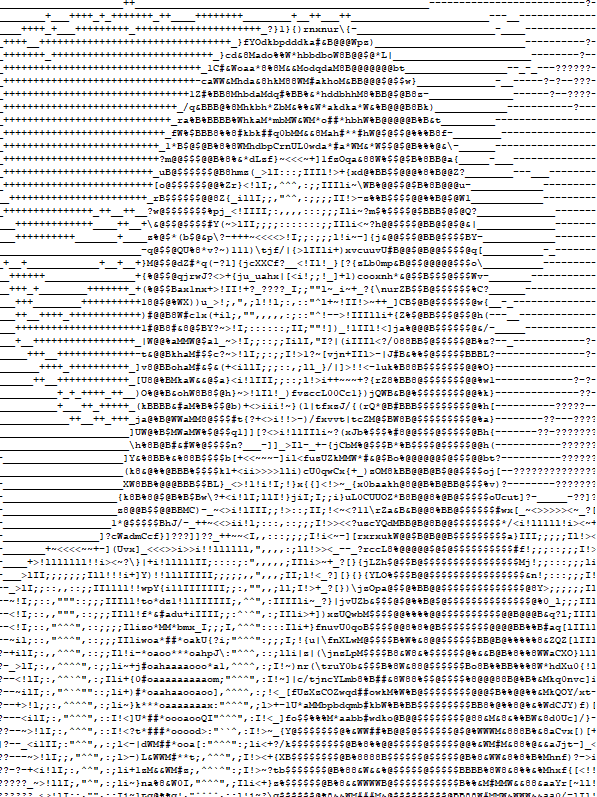
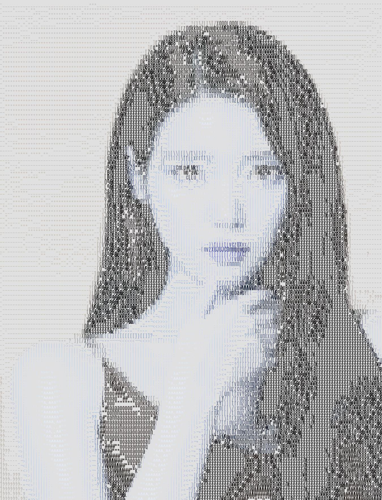

 <h1 align="center">ASCII GENERATOR✏️</h1>

## Image to text
By running the script `image2txt.py`

   
  <i>input image</i>

   
  <i>output txt</i>

## Image to image
By running the script `image2image.py`

   
  <i>output image</i>

## Video to video
By running the script `video2video.py`

   
  <i>output video</i>

## Requirements
* **python 3.12**
* **cv2 4.10**
* **PIL 10.4** 
* **numpy**
